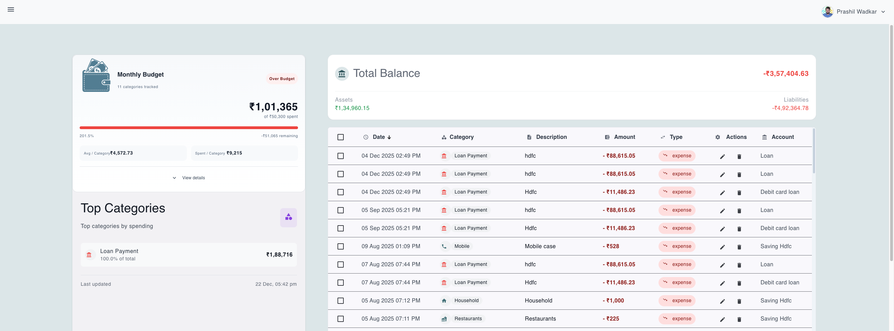
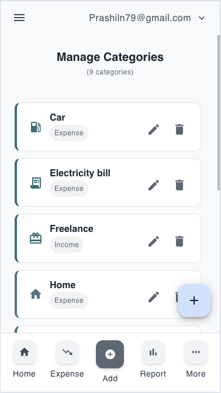
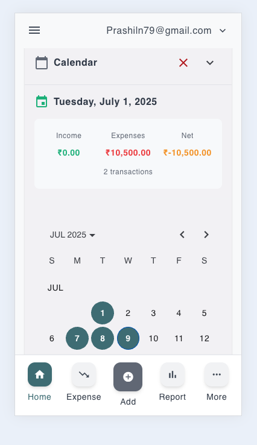
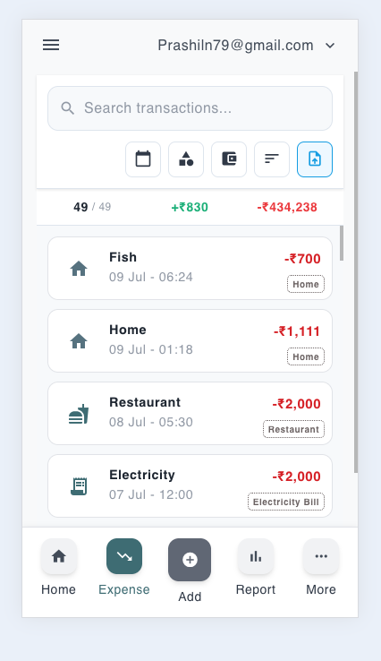

<p align="center">
  
</p>
<p align="center">
  
  
  
  
</p>
# Money Manager

A comprehensive personal finance management application built with Angular.

## Features

- **Account Management**: Track multiple bank accounts, credit cards, and loans
- **Transaction Tracking**: Record and categorize income and expenses
- **Category Management**: Organize transactions with custom categories and budgets
- **Budget Planning**: Set and monitor spending limits
- **Reports & Analytics**: Visualize your financial data
- **Offline Support**: Work without internet connection
- **PWA Ready**: Install as a mobile app

## Testing

This project includes comprehensive test coverage for all major components. Tests are automatically run during the build process to ensure code quality.

### Running Tests

```bash
# Run tests in watch mode (development)
npm test

# Run tests once with coverage (CI/CD)
npm run test:ci

# Run tests with detailed coverage report
npm run test:coverage

# Run tests using the test runner script
./scripts/run-tests.sh
```

### Test Coverage

The test suite covers:

- **Category Component**: CRUD operations, budget calculations, statistics
- **Accounts Component**: Account management, calculations, loan/credit card features
- **Transaction List Component**: Transaction management, filtering, import/export

### Test Structure

```
src/app/component/dashboard/
├── category/
│   └── category.component.spec.ts          # Category component tests
├── accounts/
│   └── accounts.component.spec.ts          # Accounts component tests
└── transaction-list/
    └── transaction-list.component.spec.ts  # Transaction list tests
```

### Coverage Requirements

- **Statements**: 80%
- **Branches**: 80%
- **Functions**: 80%
- **Lines**: 80%

## Development

### Prerequisites

- Node.js (v18 or higher)
- npm or yarn
- Angular CLI

### Installation

```bash
# Install dependencies
npm install

# Start development server
npm start

# Build for production (includes test run)
npm run build
```

### Build Process

The build process automatically:
1. Runs all tests with coverage
2. Ensures minimum 80% coverage
3. Builds the application for production
4. Fails if tests don't pass

## Project Structure

```
src/
├── app/
│   ├── component/dashboard/     # Main dashboard components
│   ├── modules/                 # Feature modules
│   ├── store/                   # NgRx state management
│   └── util/                    # Shared utilities and services
├── assets/                      # Static assets
└── environments/                # Environment configurations

```

## Screenshots

### Dashboard Overview


### Budget & Categories


### Reports & Analytics


## Contributing

1. Write tests for new features
2. Ensure all tests pass
3. Maintain minimum 80% code coverage
4. Follow Angular coding standards

## License

This project is licensed under the MIT License.
